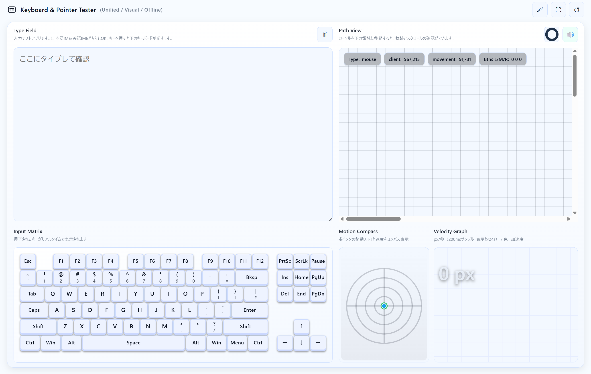

# Keyboard & Pointer Tester

統合型の入力テストツール。キーボード入力とポインター操作を可視化し、リアルタイムで動作を確認できます。



## 動作確認

- 本プロジェクト: [https://codepen.io/techmech-keeb/pen/RNrJKgm](https://codepen.io/techmech-keeb/pen/RNrJKgm)
- オリジナル: [https://codepen.io/mass-work/pen/MYaMKzo](https://codepen.io/mass-work/pen/MYaMKzo) (by [@mass-work](https://codepen.io/mass-work))

## 機能

### Type Field（入力テストエリア）
- キーボード入力のテスト
- 日本語IME/英語IME対応
- オンボードキーボードで押下キーをリアルタイム表示
- 入力内容のクリア機能

### Motion Path（マウス軌跡描写エリア）
- ポインターの軌跡を速度に応じた色で可視化
- 速度が速いほど明るく表示
- 2秒間のフェードアウト効果
- クリック時の波紋エフェクト
- 座標・移動量・ボタン状態の表示
- 100pxごとの進捗表示と音声フィードバック

### Motion Compass（ポインタ速度XY）
- ポインタの移動方向と速度をコンパス形式で表示
- スクロール速度も重ねて表示
- リアルタイムの速度ベクトル表示

### Motion Profile（速度・加速度グラフ）
- 移動速度の時系列グラフ（直近24秒）
- 加速度を色で表現（青系=減速、紫系=加速）
- 積算移動距離の表示
- 200ms単位のサンプリング

### 音声フィードバック
- 速度に応じた連続ピッチ音（速度が速いほど高音）
- 100px移動ごとのチック音
- 音声ON/OFF切り替えボタン

### テーマ機能
- 4種類のテーマ：Dark（デフォルト）、Light、Pop、Classic
- テーマ切り替えボタンで即座に変更

### その他の機能
- フルスクリーン表示
- 全機能リセット
- オフライン動作（インターネット接続不要）

## 使い方

1. **キーボード入力の確認**
   - Type Fieldにテキストを入力
   - 下部のオンボードキーボードで押下キーがハイライト表示されます

2. **ポインター操作の確認**
   - Motion Pathエリアにマウスを移動
   - 軌跡が速度に応じた色で描画されます
   - Motion Compassで速度ベクトルを確認
   - Motion Profileで時系列の速度変化を確認

3. **音声フィードバック**
   - 右上の🔊ボタンで音声ON/OFFを切り替え
   - 移動速度に応じたピッチ音を聞くことができます
   - 100px移動ごとにチック音が鳴ります

4. **テーマの切り替え**
   - ヘッダー右上の🖌ボタンでテーマを切り替え

## 技術仕様

- **HTML5 Canvas**: グラフィックス描画
- **Web Audio API**: 音声生成
- **CSS Grid/Flexbox**: レスポンシブレイアウト
- **CSS変数**: テーマシステム
- **Vanilla JavaScript**: フレームワーク不要

## ブラウザ対応

モダンブラウザ対応（以下を推奨）：
- Chrome/Edge（最新版）
- Firefox（最新版）
- Safari（最新版）

## ファイル構成

```
keyboard_and_pointer_tester/
├── tester.html          # メインファイル（全ての機能を含む）
├── README.md            # このファイル
└── screenshot.png       # スクリーンショット画像
```

## クレジット

- オリジナルプロジェクト: [@mass-work](https://codepen.io/mass-work) - [CodePen](https://codepen.io/mass-work/pen/MYaMKzo)
- 本プロジェクトは上記オリジナルをベースに機能拡張・改良したものです

## ライセンス

このプロジェクトは個人利用・学習目的で自由に使用できます。

