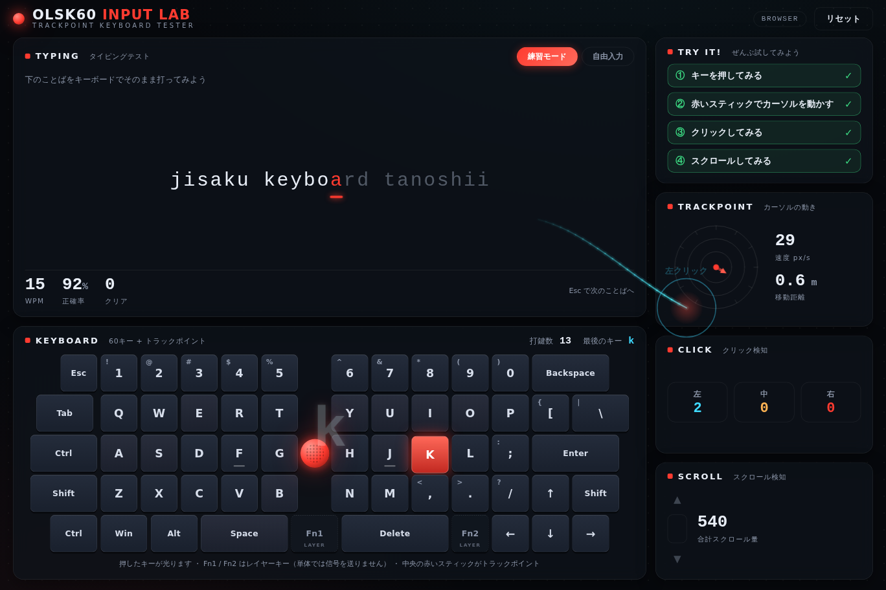
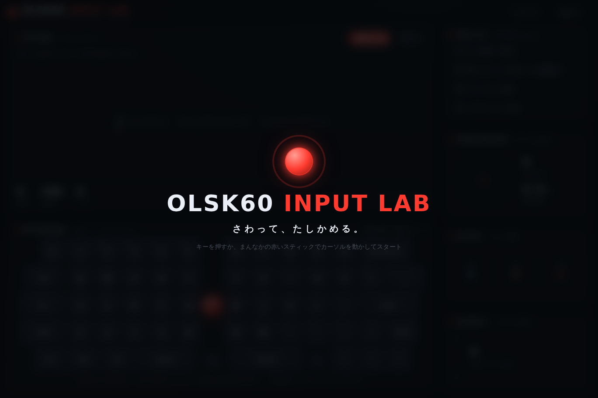

# Techmech keys INPUT LAB

トラックポイント搭載自作キーボード **OLSK60** の操作感を、通常ウィンドウの練習アプリとして、また展示会・店頭のキオスク表示として体験してもらうためのテスターです。

- トラックポイントを動かすと **カーソル軌跡が全画面に流れ**、速度で色が変わる
- キーを押すと **実機と同じ配列のキーボードが光り**、押した回数でヒートマップ化
- **タイピング練習**（WPM / 正確率）と **自由入力**（日本語IME対応）
- 初見でも迷わない **TRY IT! ミッション** と、キオスクモード時のアトラクト画面・無操作自動リセット
- **INPUT MONITOR**: クリック / スクロールのカウンタと、直近入力のライブフィード（連続入力は ×N 集約）
- ネイティブのキオスクホストが **Winキー / Alt+Tab / Alt+F4 などをブロック**し、来場者が何を押してもテスター画面から離脱しない
- **Vial連携**: Raw HID で実機からキーマップを読み出して刻印に反映、レイヤータブ表示、マトリクステスターで **HID出力のない Fn(MO/LT) キーも点灯**、レイヤー自動追従
- **ボードプロファイル**: 接続キーボードを Vial の UID / USB ID で自動判別して配列表示を切替。汎用 ANSI 60% / フルサイズ104 プロファイルも選べ、一般のキーボードのテスターとしても使える
- **デザインテーマ切替**: 標準のダーク HUD に加えてレトロ液晶風テーマを同梱。スタッフメニューから切替でき、テーマは追加拡張可能





## 構成

```text
keyboard_and_pointer_tester/
├── ui/                        # テスター本体（HTML/CSS/JS、外部依存なし・オフライン動作）
│   ├── index.html
│   ├── style.css              # 標準テーマ（ダークHUD）+ テーマ上書き用のCSS変数定義
│   ├── app.js
│   ├── boards.js              # ボードプロファイルのレジストリと自動判別（UID / USB ID）
│   ├── layouts/               # ボードプロファイル（olsk60 / generic-ansi60 / generic-fullsize）
│   ├── themes.js              # テーマのレジストリと切替・保存
│   ├── themes/                # テーマ上書きCSS（lcd.css = レトロ液晶）
│   ├── layout.js              # 共通のタイピング練習例文
│   ├── keycodes.js            # QMKキーコード→刻印変換（Vialプロトコル版数で分岐）
│   └── vial.js                # Vial/VIAプロトコル実装（キオスクブリッジ / WebHID 両対応）
├── kiosk/                     # Windows用キオスクホスト（C# WinForms + WebView2）
│   ├── OLSK60Tester.csproj
│   ├── Program.cs
│   ├── KioskForm.cs           # フルスクリーン最前面固定・フォーカス奪還・スリープ抑止
│   ├── KeyboardHook.cs        # 低レベルフックで離脱系ショートカットを吸収
│   ├── RawHidDevice.cs        # Raw HID (usage page 0xFF60) の列挙・読み書き
│   └── VialHidBridge.cs       # WebView2メッセージ⇔HID中継 + vial.json の XZ 展開
├── tools/visual-check.js      # 画面スクリーンショット検証（CIと共通）
└── .github/workflows/         # build-kiosk（exe）/ visual-check（スクショ）/ release
```

## 実行方法

### アプリモード（通常ウィンドウ / 練習用途）

1. GitHub Actions の **build-kiosk** ワークフローの Artifact `OLSK60Tester-win-x64` をダウンロードして展開
   （手元でビルドする場合は下記「ビルド」参照）
2. `OLSK60Tester.exe` を実行すると、通常のタイトルバー付きウィンドウで起動します。販売ユーザーの練習用途や、開発者の高解像度メインPCでの作業に使えます。
   - WebView2 ランタイムが必要です（Windows 10/11 には標準搭載）
   - `OLSK60Tester.exe --windowed` も後方互換のエイリアスとして同じアプリモードで起動します。

### キオスク運用（Surface Pro 7 など）

1. 展示機では `OLSK60Tester.exe --kiosk` で起動するショートカットを作成しておくことを推奨します。
2. `--kiosk` 付きで起動すると、フルスクリーン・最前面でテスターが起動します。
3. 終了はスタッフ用の隠し操作（2通り）
   - **画面左上のロゴを2.5秒以内に5回タップ/クリック** → 終了メニューが出るので「終了する」
   - キーボードから **`Ctrl + Alt + Shift + F12`**

アプリモードではキーブロック、フォーカス奪還、スリープ抑止、アトラクト自動リセットは有効になりません。

### お手軽モード（ブラウザだけで試す）

`ui/index.html` をブラウザで開くだけでも動きます（Edge のキオスクモード起動でも可）。
ただし **ブラウザだけでは Winキー等の OS ショートカットはブロックできません**。展示ではキオスクホスト経由での起動を推奨します。

## キーブロックの仕組みと限界

以下は **キオスクモード時のみ** の挙動です。`KeyboardHook.cs` が低レベルキーボードフック（`WH_KEYBOARD_LL`）で以下を吸収します。吸収したキーは WebView 経由でテスターに転送されるため、**Winキーを押しても OS には届かず、画面上のキーボードだけが光ります**。

| 操作（キオスクモード時のみ） | 挙動 |
|---|---|
| Win / Win+○○ | ブロック（スタートメニュー・Win+L 等が発動しない） |
| Alt+Tab / Alt+Esc / Alt+Space | ブロック |
| Alt+F4 | ブロック（さらにフォーム側でも Close をキャンセル） |
| Ctrl+Esc | ブロック |
| タスク切替等でフォーカスが外れた場合 | 1秒以内に自動で最前面へ復帰 |
| タスクマネージャー等の救援UI | 例外として奪い返さない（Ctrl+Alt+Del からの強制終了は常に可能） |
| バッテリー運用 | `SetThreadExecutionState` でスリープ・画面消灯を抑止 |

**ブロックできないもの**: `Ctrl+Alt+Del` は Windows のセキュア操作のためアプリからは無効化できません。展示を完全に固めたい場合は併用してください:

- タッチ画面のエッジスワイプ無効化: `HKLM\SOFTWARE\Policies\Microsoft\Windows\EdgeUI` に `AllowEdgeSwipe`(DWORD)=0
- さらに厳密にするなら Windows の割り当てられたアクセス（Assigned Access / Shell Launcher）で本アプリをシェルとして起動

## ビルド

.NET 8 SDK があれば Windows / macOS / Linux のどこでもビルドできます。

```sh
dotnet publish kiosk/OLSK60Tester.csproj -c Release -r win-x64 --self-contained \
  -p:PublishSingleFile=true -p:IncludeNativeLibrariesForSelfExtract=true -o publish
```

`publish/` に `OLSK60Tester.exe` と `ui/` フォルダが出力されます。2つセットで配置してください。

## UI ビジュアルチェック

`ui/`、`tools/visual-check.js`、または visual-check ワークフローへの push では、CI の
`visual-check` が 3 画面サイズ × 4 場面 + テーマ別メイン画面のスクリーンショットを撮影します。結果は Actions の
Artifact `visual-check-screenshots` として 14 日間保存されます。ローカルでは
`node tools/visual-check.js` を実行できます（`playwright` のインストール環境、または
`playwright-core` とブラウザを指す `CHROMIUM_PATH` が必要です）。

## バージョン管理とリリース

バージョンは **SemVer**、**単一のソースは git タグ `vX.Y.Z`** です。csproj の
`<Version>` はローカル/開発用の既定（`0.1.0-dev`）で、CI がタグから
`-p:Version=<タグ>` で上書きしてビルドに刻みます。手で csproj を書き換える
必要はありません。

- **アプリ内表示**: スタッフメニュー（ロゴ5連打）下部に `Techmech keys INPUT LAB
  vX.Y.Z` を表示（キオスクホストが exe のバージョンを UI へ通知）。ブラウザ/
  開発ビルドでは `dev` と表示。展示機がどの版かを現地で確認できます。
- **リリースの作り方**: タグを push するだけ。

  ```sh
  git tag v1.2.3
  git push origin v1.2.3
  ```

  `.github/workflows/release.yml` が発火し、win-x64 単一ファイルを
  バージョン刻印付きでビルド → `OLSK60Tester-v1.2.3-win-x64.zip` を添付した
  **GitHub Release を自動作成**（リリースノートは自動生成）。Actions の
  一時成果物と違い、リリースは消えずにバージョン付きで残ります。
- **手動リリース**: Actions の `release` を「Run workflow」で実行。次の2通り。
  - **バージョンを直接入力**（`version` に例 `1.2.3`）→ その値でリリース（`bump` は無視）。
  - **`bump` を選ぶ**（`version` は空のまま）→ 前回リリースのタグを基点に自動附番:
    - `auto`: **前回リリース以降のコミット**を Conventional Commits で判定して
      major/minor/patch を自動決定
    - `patch` / `minor` / `major`: コミット内容を見ずに指定の位置を +1
  - いずれも、その時点のコミットにタグ（`vX.Y.Z`）を作ってリリースします。
- **auto の判定ルール**（コミットメッセージ規約に依存）:
  | コミット | 上げる位置 |
  |---|---|
  | `feat!:` / 任意の `type!:` / 本文に `BREAKING CHANGE` | major |
  | `feat:` | minor |
  | それ以外（`fix:` / `chore:` / `docs:` など、規約外も含む） | patch |

  規約に沿わないメッセージは patch 扱いになります。minor/major を自動で
  出したいときは `feat:` / `feat!:` を使うか、`bump` で明示指定してください。
- 日常の CI ビルド（`build-kiosk.yml`）はブランチ push で従来どおり動きます。
  配布はタグ＝リリース、と役割を分けています。

## テスターの機能

### KEYBOARD（ボードプロファイル）

- 表示配列は**ボードプロファイル制**。既定は OLSK60 v2 の実配列（[公式KLEデータ](https://www.keyboard-layout-editor.com/#/gists/641df3ee125afe1bd4ef41c9a0cded7d)準拠、60キー + 中央トラックポイント）
- Vial 対応機を接続すると、**UID / USB ID で自動判別**して配列・キー数表示が切り替わる（未登録ボードは現在の表示を維持）
- スタッフメニューの「既定ボード」で **汎用 ANSI 60%（61キー）/ フルサイズ（ANSI 104）** も選択可能。押した物理キーが `KeyboardEvent.code` で対応位置に点灯するため、OLSK60 以外の一般キーボードのテスターとしても使える（設定は端末ごとに保存）
- 押下中は赤く点灯、押した回数に応じてキーが「熱を持つ」ヒートマップ表示
- 押したキーの大型OSD表示、打鍵数・最後のキーの表示
- Fn1 / Fn2 はレイヤーキー（単体では信号を送らない）として破線表示
- キオスクモード時は Win キーに 🔒 マーク

### TRACKPOINT

- カーソル軌跡を全画面 HUD として描画（標準テーマではゆっくり=シアン → 速い=赤。配色はテーマに追従）
- 画面中央のキーボード上のトラックポイントも、カーソルの動きに合わせて傾いて光る
- クリックは波紋+ラベル（左/中/右/タッチ）、スクロールは連続シェブロンで可視化。**エフェクトの大きさは画面サイズに比例**し、大型モニタでも遠目に見える
- コンパス（移動方向）、速度 px/s、累計移動距離（メートル換算）

### INPUT MONITOR

- クリック（左/中/右）の回数カウンタとスクロール累計量
- **直近入力のライブフィード**: クリック・スクロールを新しい順に表示。同種の連続入力は ×N に集約、画面が高いほど表示行数が増える。自動リセット・リセットボタンでクリア

### TYPING

- **練習モード**: 短いお題を打つと WPM / 正確率 / クリア数を集計。`KeyboardEvent.code` フォールバックにより IME がオンのままでも動作。Esc でお題スキップ。フォーカスする入力欄を持たないため IME 非依存（変換候補ウィンドウが出ない）
- **自由入力**: 日本語IMEの未確定文字（下線表示）・確定を含めて表示。**日本語IMEに依存する処理はこのタブ1枚に閉じ込めてある**
  - **日本語入力トグル**: スタッフメニュー（ロゴ5連打）→「表示オプション」で自由入力タブの表示を ON/OFF できる。設定は端末ごとに `localStorage` に保存され、切替に再ビルドは不要
  - **既定はオフ**（`app.js` の `JP_INPUT_DEFAULT`）。展示機を初期状態のまま使えば IME・変換候補ウィンドウの環境依存問題が構造的に発生しない。実機で日本語入力と候補ウィンドウの見え方を確認できたら、スタッフメニューからオンにする運用を推奨

### デザインテーマ

- **スタンダード**（ダーク HUD、既定）と**レトロ液晶**（明色紙背景 + インク色 + 等幅フォントの計測機器風）を同梱
- スタッフメニュー →「表示オプション」→「デザイン」で切替。設定は端末ごとに `localStorage` に保存
- テーマは `ui/themes.js` のレジストリ + `ui/themes/*.css`（CSS 変数の上書き）で追加できる。Canvas エフェクトの配色も CSS 変数経由でテーマに追従する

### スタッフメニュー（ロゴ5連打 / Ctrl+Alt+Shift+F12）

- 終了操作（キオスクモード時）
- VIAL 連携の状態表示と unlock ウィザード
- 表示オプション: **既定ボード** / **デザイン（テーマ）** / **日本語入力トグル** / **ウィンドウサイズ（アプリモードの exe のみ）** — いずれも端末ごとに保存または即時反映、再ビルド不要
- アプリのバージョン表示

### キオスク向け挙動

- 起動時と 75 秒無操作でアトラクト画面に戻り、全カウンタを自動リセット（次の来場者用）
- 描画は入力があるときだけ `requestAnimationFrame`、DPR 上限 1.5（バッテリー配慮）
- 右クリックメニュー・テキスト選択・ズーム・スワイプナビゲーション無効
- レスポンシブ対応: 幅 1100px 以下は1カラム表示、1800px 以上は右カラムを拡幅

## Vial連携

接続した OLSK60（vial-qmk）から **Vialプロトコル標準機能のみ**で情報を取得します。ファーム独自パッチには依存しないため、将来の RMK+Vial 移行後もそのまま動く想定です。

### 動作モード（自動フォールバック）

| 環境 | 経路 | できること |
|---|---|---|
| キオスクホスト (exe) | C# Raw HID → WebView2 postMessage ブリッジ | フル機能（vial.json 取得含む） |
| ブラウザ単体 (Chrome/Edge) | WebHID（バッジをクリックして接続） | vial.json 取得以外のフル機能（マトリクス構成はボードプロファイルの値を使用） |
| キーボード非接続 | — | 既定ボードプロファイルの刻印表示（スタッフメニューで選択可） |

### 取得している情報

1. **接続**: usage page `0xFF60` / usage `0x61` の Raw HID インターフェースを列挙し、`vial_get_keyboard_id`（`0xFE 0x00`）に正しく応答した最初のデバイスへ接続。取得した **UID / USB ID が登録済みボードプロファイルに一致すると表示ボードを自動切替**
2. **マトリクス構成**: `vial_get_size` / `vial_get_def`（`0xFE 0x01/0x02`）でファーム内蔵 vial.json（XZ圧縮）を取得し、rows/cols・customKeycodes を自動取得（XZ展開はC#ホスト側。ブラウザ単体時は layout.js のフォールバック値）
3. **キーマップ**: VIA互換 `dynamic_keymap_get_layer_count`（`0x11`）+ `get_buffer`（`0x12`）で全レイヤーを読み出し、QMKキーコード→刻印変換してキーボード表示へ反映
   - `KC_TRNS` は下位レイヤーの刻印を淡色で継承表示
   - キーコード番号体系は Vialプロトコル版数（v6=新QMK / v5以前=旧QMK）で分岐
4. **ライブ検出**: マトリクステスター（`0x02 0x03` switch_matrix_state）を約30Hzでポーリングし、物理押下でキーを点灯（HID出力のない MO/LT キーも光る）。MO/LT 押下で表示レイヤーを自動切替、TG/TO はエッジ追跡

### unlock（マトリクス検出の有効化）

マトリクステスターは Vial のセキュリティ仕様により **unlock 済みのときだけ**応答します。

- ロック中は「レイヤー刻印表示 + 手動レイヤータブ」の縮退モードで動作
- スタッフメニュー（ロゴ5連タップ）の **unlockウィザード**で解錠できます。画面上でハイライトされるキー（OLSK60 は Esc + Enter）を数秒間押し続けると完了（`0xFE 0x06/0x07`）
- 注意: 一度ウィザードを開始すると、完了するまでファームは unlock 進行中状態になり大半のコマンドを受け付けません。中断した場合はキーボードを挿し直すか、再度ウィザードを完了させてください
- unlock 状態はキーボードの電源が切れるまで維持されます（展示開始時に一度実行すればOK）

### RMK 移行時の再確認事項

- ロック中でもキーマップ読み出しが可能か（vial-qmk は可能）
- マトリクステスター応答のバイト配置（行ごとの big-endian パック）が同一か
- Vialプロトコル版数とキーコード番号体系（`ui/keycodes.js` の分岐で吸収）

## クレジット

- OLSK60 / OLSK60 v2: [Techmech keys](https://techmech.booth.pm/)
- 旧バージョンのテスターは [@mass-work さんの CodePen](https://codepen.io/mass-work/pen/MYaMKzo) をベースにしていました。現バージョンは全面書き直しです

## ライセンス

このプロジェクトは個人利用・学習目的で自由に使用できます。
