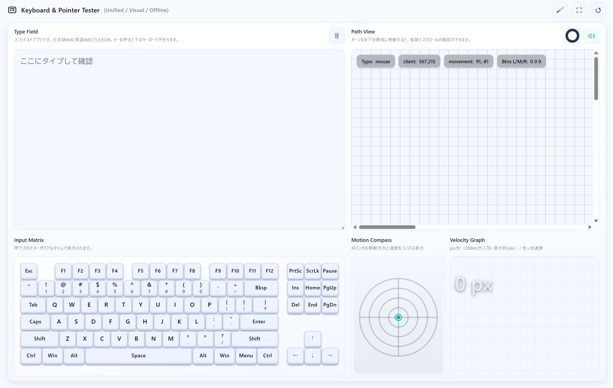

# Keyboard & Pointer Tester — Kiosk MVP

Surface Pro 7 と ThinkPad X9 14インチを想定した、Edge キオスクモード向けのローカル HTML 入力テストツールです。ページがアクティブな状態で、特定の入力欄や描画領域をクリックしなくても、キーボード入力・文字入力・ポインター操作を 1 画面で可視化します。



## 実行前提

- **端末**: Surface Pro 7、ThinkPad X9 14インチ
- **ブラウザ**: Microsoft Edge
- **起動形態**: Edge キオスクモードでローカルの `tester.html` を表示
- **ネットワーク**: 不要（外部ライブラリや CDN なし）
- **保存**: キオスク運用を優先し、設定保存や入力ログ保存には依存しません

> 注意: OS や Edge キオスクモードに予約されたキー、ブラウザがブロックするショートカット、別アプリ・別タブの入力は JavaScript から取得できない場合があります。

## 画面構成

### Header / Status / Reset

- 入力キャプチャ状態を `CAPTURE ON / OFF` で表示
- `Pause / Resume` で入力キャプチャを一時停止・再開
- `Reset` で文字列、キー履歴、ポインター軌跡、ステータスを初期化

### Global Pointer Canvas

- 画面全体の `pointermove` を検知し、上部のキャンバスへ軌跡として表示
- `pointerdown` でクリック・タップ位置に波紋を表示
- mouse / touch / pen の `pointerType` をステータス表示
- viewport 座標をキャンバス座標へスケーリングして描画

### Live Text

- 表示用ビューと隠し `textarea` を分離
- ページがアクティブな状態でキー入力した文字列を表示
- `Backspace`、`Enter`、`Tab` の最小編集操作に対応
- IME 入力中の未確定文字を下線付きで表示し、確定時に本文へ反映

### Keyboard Matrix

- 既存のフルキーボード表示を継続
- 入力検知は `document` レベルで行い、特定の `textarea` フォーカスに依存しません
- 押下中のキーは `down`、押下履歴は `pressed` としてハイライト

### Pointer Status / Input Status

- Pointer Status: 入力種別、座標、移動量、ボタン状態を表示
- Input Status: 最後のキー、物理キーコード、IME状態、ホイール累積量を表示

## 使い方

1. Edge キオスクモード、または通常の Edge で `tester.html` を開きます。
2. ページがアクティブな状態でキーを押すと、Live Text に文字が表示され、Keyboard Matrix がハイライトされます。
3. 画面上でマウス、タッチパッド、タッチ、ペンを動かすと、Global Pointer Canvas に軌跡が表示されます。
4. クリックまたはタップすると波紋が表示されます。
5. テストをやり直す場合は `Reset` を押します。

## MVPで意図的に後回しにした機能

- 音声フィードバック
- テーマ切り替え
- Motion Compass
- Velocity Graph
- 速度に応じた軌跡の高度な色分け
- 入力ログ保存・エクスポート
- 本格的なテキストエディタ機能（任意位置編集、選択範囲、Undo/Redo など）
- 全画面透明オーバーレイキャンバス

## 技術仕様

- **単一HTML**: `tester.html` に CSS / JavaScript を内包
- **Vanilla JavaScript**: フレームワーク不要
- **HTML5 Canvas**: Global Pointer Canvas の軌跡・波紋描画
- **Pointer Events**: mouse / touch / pen を統合的に検知
- **Keyboard Events**: `document` レベルの `keydown` / `keyup` でグローバル入力を検知
- **Composition Events**: IME の未確定・確定入力を処理
- **高DPI対応**: `devicePixelRatio` に応じて Canvas をリサイズ
- **オフライン動作**: 外部通信なし

## ファイル構成

```text
keyboard_and_pointer_tester/
├── tester.html          # Kiosk MVP メインファイル
├── odometer.html        # 参考実装ファイル
├── README.md            # このファイル
└── screenshot.png       # スクリーンショット画像
```

## クレジット

- オリジナルプロジェクト: [@mass-work](https://codepen.io/mass-work) - [CodePen](https://codepen.io/mass-work/pen/MYaMKzo)
- 本プロジェクトは上記オリジナルをベースに、キオスク向けの最小構成へ刷新したものです。

## ライセンス

このプロジェクトは個人利用・学習目的で自由に使用できます。
