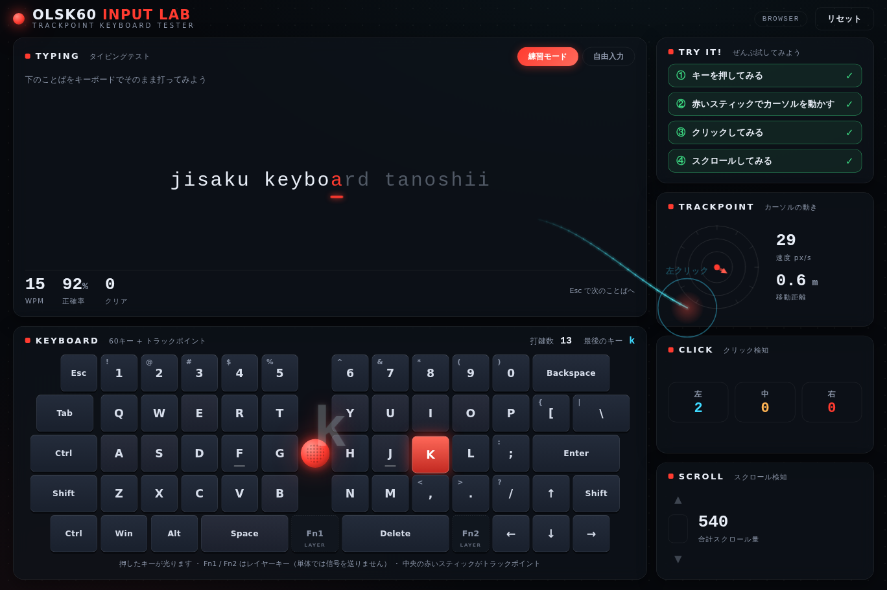
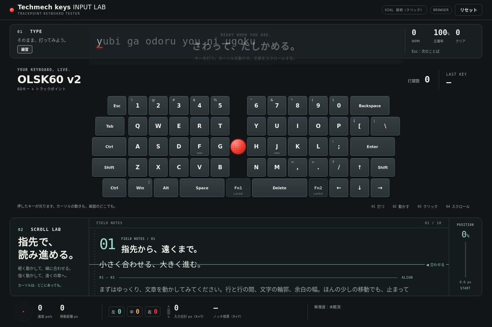

# Techmech keys INPUT LAB

トラックポイント搭載自作キーボード **OLSK60** の操作感を、通常ウィンドウの練習アプリとして、また展示会・店頭のキオスク表示として体験してもらうためのテスターです。

- トラックポイントとキー入力を全画面で可視化する（カーソル軌跡・打鍵ヒートマップ・クリック/スクロールの計測）
- **タイピング練習**（WPM / 正確率）、**自由入力**（日本語IME対応）、長文を動かす **SCROLL LAB** を常時併用できる
- **Vial連携**: 実機からキーマップを読み出して刻印に反映し、HID 出力のない Fn(MO/LT) キーも点灯させる
- **ボードプロファイル**: 接続キーボードを Vial の UID / USB ID で自動判別。汎用 ANSI 60% / フルサイズ104 も選べ、一般のキーボードのテスターとしても使える
- ネイティブのキオスクホストが **Winキー / Alt+Tab / Alt+F4 などをブロック**し、来場者が何を押しても画面から離脱しない
- 外部依存なし・オフライン動作（`ui/` は素の HTML/CSS/JS）





## 実行方法

### アプリモード（通常ウィンドウ / 練習用途）

1. GitHub Actions の **build-kiosk** ワークフローの Artifact `TechmechInputLab-win-x64-ci-<実行番号>` をダウンロードして、新しいフォルダへ展開
   （手元でビルドする場合は下記「ビルド」参照）
2. `TechmechInputLab.exe` を実行すると、通常のタイトルバー付きウィンドウで起動します。販売ユーザーの練習用途や、開発者の高解像度メインPCでの作業に使えます。
   - WebView2 ランタイムが必要です（Windows 10/11 には標準搭載）
   - `TechmechInputLab.exe --windowed` も後方互換のエイリアスとして同じアプリモードで起動します。

### キオスク運用（Surface Pro 7 など）

1. 展示機では `TechmechInputLab.exe --kiosk` で起動するショートカットを作成しておくことを推奨します。
2. `--kiosk` 付きで起動すると、フルスクリーン・最前面でテスターが起動します。
3. 終了はスタッフ用の隠し操作（2通り）
   - **画面左上のロゴを2.5秒以内に5回タップ/クリック** → 終了メニューが出るので「終了する」
   - キーボードから **`Ctrl + Alt + Shift + F12`**

アプリモードではキーブロック、フォーカス奪還、スリープ抑止、アトラクト自動リセットは有効になりません。

### お手軽モード（ブラウザだけで試す）

`ui/index.html` をブラウザで開くだけでも動きます（Edge のキオスクモード起動でも可）。
ただし **ブラウザだけでは Winキー等の OS ショートカットはブロックできません**。展示ではキオスクホスト経由での起動を推奨します。

## できること

| 機能 | 概要 |
|---|---|
| KEYBOARD | 実機と同じ配列が光る。押下回数でヒートマップ、Fn は破線表示 |
| TRACKPOINT | カーソル軌跡の全画面 HUD、速度・方向・累計距離 |
| INPUT MONITOR | クリック/スクロールのカウンタ、直近入力のライブフィード |
| SCROLL LAB | 画面のどこからでも長文を動かす。小数 delta を保持した換算 |
| TYPING | 練習モード（WPM / 正確率）と自由入力（IME 対応・既定オフ） |
| デザインテーマ | ダーク HUD とレトロ液晶を同梱。スタッフメニューで切替 |

→ 詳細は [`docs/guide/features.md`](docs/guide/features.md)

## 展示運用

キーブロックの範囲と限界、スタッフメニュー、アトラクト自動リセット、
**TIL 起動中は Vial が繋がらない**（先に一方を終了する）といった現地で要る話は
[`docs/guide/exhibition.md`](docs/guide/exhibition.md) にまとめてあります。

## Vial連携

接続した OLSK60 から **Vialプロトコル標準機能のみ**で情報を取得します（ファーム独自パッチ非依存）。
キオスクホストは Raw HID、ブラウザ単体は WebHID、未接続時は既定ボードプロファイルの刻印表示、と
自動でフォールバックします。

→ 取得している情報・unlock・RMK 移行時の再確認は [`docs/design/vial-integration.md`](docs/design/vial-integration.md)

## ビルド

.NET 8 SDK があれば Windows / macOS / Linux のどこでもビルドできます。

```sh
dotnet publish kiosk/TechmechInputLab.csproj -c Release -r win-x64 --self-contained \
  -p:PublishSingleFile=true -p:IncludeNativeLibrariesForSelfExtract=true -o publish
```

`publish/` に `TechmechInputLab.exe` と `ui/` フォルダ、ライセンス3ファイルが出力されます。

→ リポジトリ構成、CI（`build-kiosk` / `visual-check`）、タグでのリリース手順は
[`docs/development.md`](docs/development.md)

## ドキュメント

[`docs/INDEX.md`](docs/INDEX.md) が目次です。よく使うのは次の3本。

- [`docs/guide/exhibition.md`](docs/guide/exhibition.md) — 展示運用
- [`docs/development.md`](docs/development.md) — ビルド・CI・リリース
- [`docs/roadmap.md`](docs/roadmap.md) — 残課題と実機確認チェックリスト

## クレジット

- OLSK60 / OLSK60 v2: [Techmech keys](https://techmech.booth.pm/)
- 旧バージョンのテスターは [@mass-work さんの CodePen](https://codepen.io/mass-work/pen/MYaMKzo) をベースにしていました。現バージョンは全面書き直しです

## ライセンス

コードは [Apache License 2.0](LICENSE) です。**改変・再配布・商用利用ができます**。条件は
Apache-2.0 の定めどおりで、要点は次の2つです。

- **当方の権利表示を残すこと**: 再配布する成果物に `LICENSE` と [`NOTICE`](NOTICE) の内容
  （`Copyright 2025-2026 Techmech keys`）を含め、変更したファイルには変更した旨を書く。
- **当方の商標は使えないこと**（Apache-2.0 第6条）: 「Techmech keys」「Techmech keys INPUT LAB」
  「OLSK60」「Platyx」などの名称・ロゴ、および `docs/` 配下の製品画像は許諾に含みません。
  フォークを配布するときは名称と画像を差し替えてください。

詳細と除外対象の一覧は [`NOTICE`](NOTICE) にあります。

同梱する第三者コンポーネント（WebView2 SDK / SharpCompress / .NET ランタイム）の表示は
[`THIRD-PARTY-NOTICES.md`](THIRD-PARTY-NOTICES.md) にまとめてあります。`LICENSE` /
`NOTICE` / `THIRD-PARTY-NOTICES.md` の3ファイルは exe と同じ場所に出力されるので、
配布 zip や `publish/` フォルダにもそのまま入ります。
